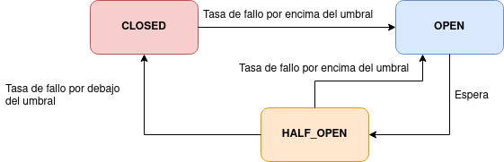

### Circuit Breaker Pattern

- Máquina de estados que hace un seguimiento de errores al intentar comunicar con servicios que no dan respuesta
- Cuando el nº de errores supera el umbral preestablecido, se pasa al estado Open
- Tras el tiempo de espera, se pasa a medio abierto (half_open)
- Efectuando intentos de reconexión, si se subsana, se pasa a estado closed (funcionamiento correcto), y si no de nuevo a open

### Ejecución

**Circuit Breaker** 

- Establece un circuito para evitar solicitudes innecesarias a otros servicios y evitar bloqueos
  - Para verificar el circuit breaker, efectuar varias requests a http://localhost:8080/api/timeDelay/10

**Time Limiter**

- Error para proceso de solicitudes lentas.
  - Para verificar el timeout, invocar http://localhost:8080/api/timeout/5

### Highlights

- Registrador de eventos producidos por Circuit Breaker en Resilience4jListener
- CircuitBreaker y TimeLimiter en endpoints de Controller

### Docs

Resilience4j docs en https://resilience4j.readme.io/docs